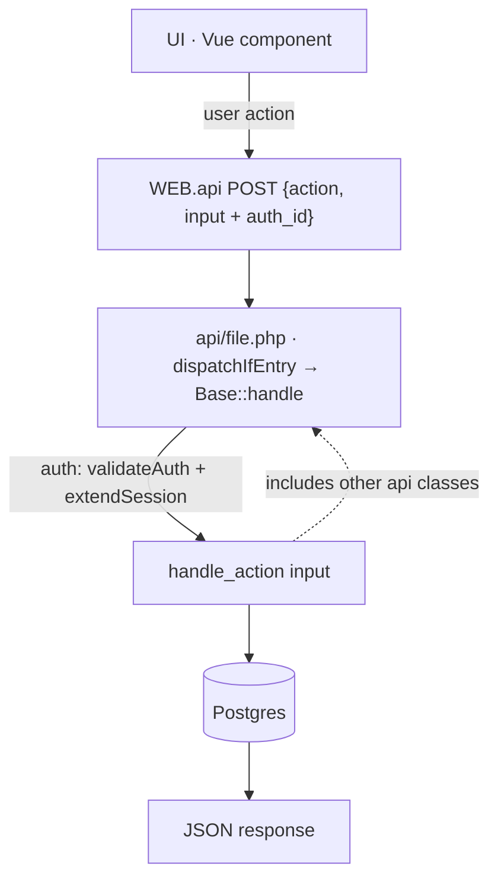
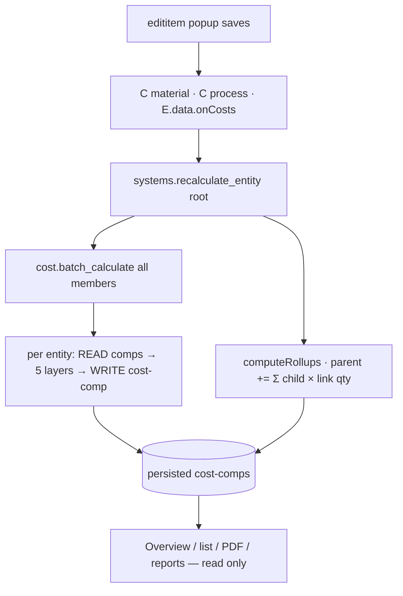

# LOGIC.md — fabricate_forge — what runs where, and where data goes

> **Relationship to MAP.md:** MAP.md = structure (who calls what, file index). LOGIC.md = behavior:
> per-file functions and their dataflow — what each function reads, what it writes, what it returns.
> Marks: ✅ live-verified · 🟡 static-traced.
> Notation: `E` = entity table · `C` = component table · `L` = link table · `cost-comp` = component type='cost'.
> Todos/backlog live in `AUDIT_TODO.md`.

---

## 1. The transport every function rides on


- Every handler scopes reads/writes by `user_id_owner`; cross-user access = silent 404. ✅
- No websockets/timers anywhere — staleness is only fixed by calling `systems.recalculate_entity`.

## 2. The spine — how money moves



The 5 layers in `handle_calculate_entity`: material (costPerEa | costPerM | mass×R/kg) →
process (manual ops hrs × rate) → on-costs (paint/lining when configured; defaults 2.5%/1%/1.5% for fabricated items) →
transport (R850/ton ×1.35 subcon) → margin (entity > quote > prefs > 30%).

---

## 3. Function map — api files

### money chain

**api/cost.php** — the 5-layer engine (ECS contract: read comps → compute → write cost-comp)
| Function | Reads from | Writes to / Returns |
|---|---|---|
| `handle_calculate_entity {entity_id, options}` | C(material)+library row via `_base.materialRowShape`, C(process), rate hierarchy (`rates.getAllEffectiveRates`), E.data.onCosts/marginPercent | upserts cost-comp `{material, bmHrs/wHrs/mHrs, consumables…, subtotal, margin, total, unitCost, details{kind, weldSize, areas}}`; returns `{component_id, data}` 🟡 |
| `handle_batch_calculate {entity_ids}` | — | loops calculate_entity; result rows carry `component_id` so callers can patch rolled values ✅ |

Tree walking — exactly **two** walkers, by design:
- `_base::recalculateUpward` + `rollupEntityChildren` — INCREMENTAL: on every single-item mutation, calc own → roll children → walk to parent → persist root total. Cheap per save.
- `systems::computeRollups` — BATCH: memoized per-unit DFS over the whole quote member set, used only by recalculate_entity after bulk ops (import/add_items).
| `get_costs_by_entities(ids)` | C(type='cost') one query | `{entityId: costData}` — THE read seam for UI/reports/pdf |
| `handle_get_cost`, `patch_entity_cost`, `write_entity_cost`, `clear_entity_costs` | C(cost) | read / jsonb-merge patch / create-or-patch / delete-all-for-quote-root (forced-recalc escape hatch) |

**api/process.php** — hours extraction + pricing (L2)
| Function | Reads | Returns |
|---|---|---|
| `hoursForEntity(id, ctx)` | C(process) — `{ops:[{category,hours,summary}]}` (+legacy flat keys merged by `mergeHours`) | `{trade: hours}` map |
| `pricedFragment(hours, rates, qty)` | pure math | per-trade costs + `processTotal/labor` + exposed hour fields — cost.php sums this into L2 |
| `handle_get_registry` | TRADES const | trade names + global default rates (UI dropdown source) |

**api/rates.php** — rate hierarchy feeding L2
| Function | Reads | Returns/Writes |
|---|---|---|
| `handle_get_all_effective` | entity rate comp → company settings → GLOBAL_DEFAULT_RATES (rates.php:95-124) | `{trade:{rate}}` used by cost.php ✅ |
| `handle_set_entity_rate` / `set_company_rates` | — | writes rate comp / settings row (Settings UI) |

**api/systems.php** — orchestration + read models
| Function | Reads | Writes/Returns |
|---|---|---|
| `handle_overview {quote_id}` | E(quote) + root cost-comp | header + per-column totals — **pure read, zero writes** ✅ |
| `handle_entity_items {entity_id, scope?, search?}` | link-table subtree (recursive CTE, DISTINCT nodes) + persisted cost comps + material labels via `materialEntitiesByIds` | paged member rows w/ full cost comp embedded — **pure read** ✅. THE quote-page items read (ADR: systems-mediated reads); no quote_id filtering, no silent cap |
| `handle_entity_tree {entity_id}` | delegates to links.tree_batched | nested tree, pure read ✅ |
| `handle_recalculate_entity` | ALL entities of quote | THE mutation path: batch_calculate → `computeRollups` → persists rolled values onto exact comps (via component_id) + root totals → returns fresh overview |
| `handle_list_quotes` | persisted cost-comps only | light rows for dashboard/list — never recalcs ✅ |
| `resolveRootMargin` | quote.data → user prefs | margin % fallback chain |

### ECS core

**api/entities.php** — quote items
`handle_create/update/delete` ↔ E rows (type ∈ part/assembly/fastener/fitting; quantity = BoQ count).
`handle_list {quote_id}` → grid rows (+`attachParentInfo` adds parent/link qty). LEGACY for views: quote pages read via systems.entity_items now (ADR); entities.list remains for generic/picker contexts.
`handle_get_full` → entity + its components (edititem popup payload).

**api/components.php** — typed JSONB blobs on entities
`handle_create/update/replace/delete` ↔ C rows (type ∈ material/process/rate/cost/specification…).
`handle_get_by_quote {quote_id}` → ALL components for the quote in one query; client groups by entity_id → this is how grids project cost/material/process columns.

**api/links.php** — the BOM tree
`handle_create/update/delete` ↔ L rows (contains/…; `validate_cycle`+`findCycle` guard DAG).
`handle_tree_batched {entity_id}` → recursive contains-tree, batched per level (no N+1) → Tree tab.

### intake chain (BoQ/BOM → entities)

**api/import.php**
`handle_parse_boq` → messy rows in, normalized rows out (`normalizeRow`: size/unit/qty/type/spec) with flags ok/unclear/error/duplicate/skip ✅ Gate 1. Pure transform — no writes.

**api/rfq.php** — RFQ tab backend
`handle_upload` → file → Forge store (files_meta/files_data) + rfq_document row; parsed_rows JSONB.
`handle_import` → review-grid rows → E+C creates; PIPE SPOOL/CLOSURE decomposed via `decomposeSpoolFlanges` (assembly → pipe part + flange children w/ weldType, pipeOd, pipeWt; library lookups via `lookupLibraryRow/Id`) ✅ Gate 2; lineage stamped by `boqLineageData` (boq_source_file/item_no/section/qty).

**api/boms.php** — legacy paste-import + take-off + compat
| Function | In → Out |
|---|---|
| `handle_import` | CSV/textarea rows → detectEntityType (regex) → E + optional C(material) if `matchMaterial` ≥ 0.3 → `linkHierarchy` builds contains-links from item-number dots |
| `handle_takeoff` | E + C(material/cost) + library → groups by category AND size (`takeOffGroup`, lengths incl. green secondary in `takeOffLine`) → `{materials[], totals{mass,cost,distinct}}` → takeoff-split assigns suppliers → CSV/PDF per supplier |
| `handle_compat` | walks tree for pipe↔flange DN mismatches → `{issues, suggestions}` (server-side only; no UI tab since consolidation) |
| `handle_calculate` | thin shortcut → calls systems.recalculate_entity |

### workflow

**api/quotes.php** — quote lifecycle
`create/get/list/update/delete` ↔ quotes+E(quote) rows; `create` seeds quoteNumber/status/statusHistory + default margin.
`update_status` → VALID_TRANSITIONS guard (409 + allowed list), appends statusHistory ✅.
`add_entity/add_items/remove_entity` → E/L writes (+recalc at call sites).
`export_pdf` → composes overview + entities + `get_costs_by_entities` → server-rendered HTML invoice/table (the single PDF seam).

**api/prefabs.php** — templates
`instantiate` → template items → recursive E/C/L creation → prefab_instance row → recalc (non-fatal ⚠️). `bake_from_quote` → reverse: quote entities → template_data.

### reference data

**api/materials.php** — library (entities type='material'; legacy mirror bridged by `materialRowShape`)
`list/get/create/update/delete` ↔ material entities (+specification/dimensions/rate comps via `patchMaterialComp`); `match` fuzzy-search for BOM matching; `get_density` for mass math. Scope = shared-admin library + own rows.

### plain CRUD (one table in, one table out)

auth (session tokens) · user/admin/settings (prefs, company settings) · team (owner/member/invite) · clients · suppliers · orders · procurement (PO/SQ/RG) · production (records/variance) · reports (aggregates over persisted cost-comps).

Pure-math statics (no DB): `_base.massCompute` (kind-aware kg), `weldmodel.*` (weld size/length/metal-mass metadata + surface areas — display only since D3), `process.pricedFragment`, `tools.calculate`.

---

## 4. How it fails

| Failure | Behavior |
|---|---|
| Unauthenticated call | 401 explicit ✅ |
| Cross-user access | silent 404 (no leak) ✅ |
| Invalid status transition | 409 + allowed list ✅ |
| BOM material no-match | imported with zero material cost, toast claims "materials matched" ⚠️ |
| Recalc crash mid-instantiate | swallowed — instance created, total null ⚠️ |
| Paint not configured | paint stays 0 silently |
| Fitting without unit_cost | SS/Al/carbon R/kg fallback may misprice exotic alloys |

## 5. Replay recipes

```bash
API=http://127.0.0.1:8099/api
AID=$(curl -s -X POST $API/auth.php -d '{"action":"login","input":{"email":"api-test@fabricate.local","pass":"TestPass123!"}}' | jq -r .data.auth_id)
# …every call: {"action":…,"input":{…,"auth_id":"'$AID'"}}

curl -s -X POST $API/quotes.php    -d '{"action":"create","input":{"name":"replay","auth_id":"'$AID'"}}'
curl -s -X POST $API/systems.php   -d '{"action":"recalculate_entity","input":{"entity_id":"<QID>","auth_id":"'$AID'"}}'
curl -s -X POST $API/boms.php      -d '{"action":"takeoff","input":{"quote_id":"<QID>","auth_id":"'$AID'"}}'
./tests/run-phase.sh 3              # cost engine regression

# ground truth — the written cost comp IS the quote number:
PGPASSWORD=$DB_PASS psql -h $DB_HOST -p $DB_PORT -U $DB_USER -d $DB_NAME -c \
  "select jsonb_pretty(data) from component where type='cost' and entity_id='<EID>';"
```
